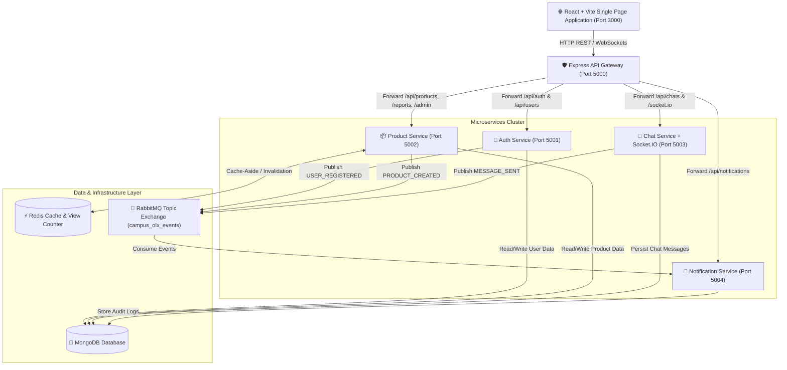
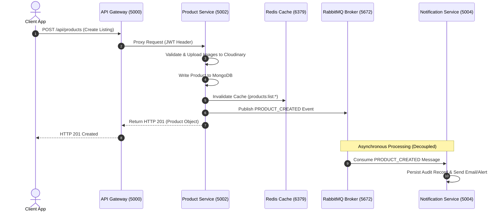
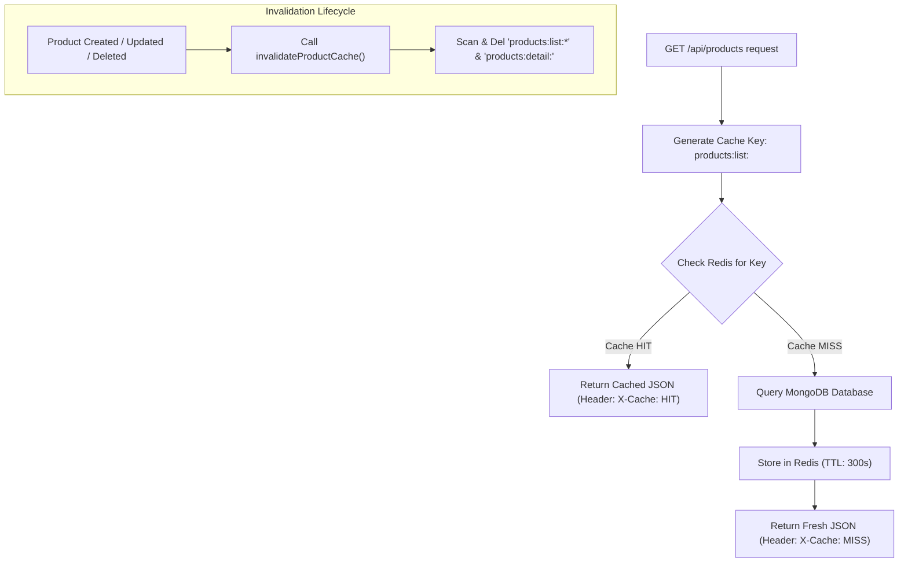
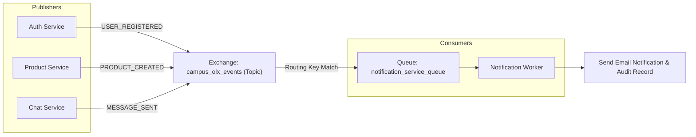

# Campus OLX - Distributed Microservices Architecture & Technical Documentation

Campus OLX is an enterprise-grade college marketplace platform engineered with a backend-focused microservices architecture, distributed caching layer, asynchronous event-driven messaging, and containerized orchestration.

---

## 1. High-Level Architecture Diagram



---

## 2. Service Communication Diagram



---

## 3. Docker Architecture Diagram

```mermaid
graph LR
    subgraph Docker Host Container Network (campus-network)
        FE["campusolx-frontend (Nginx Port 3000 -> 80)"]
        GW["campusolx-api-gateway (Port 5000)"]
        
        AS["campusolx-auth-service (Port 5001)"]
        PS["campusolx-product-service (Port 5002)"]
        CS["campusolx-chat-service (Port 5003)"]
        NS["campusolx-notification-service (Port 5004)"]

        MDB[("campusolx-mongodb (Port 27017)")]
        RDS[("campusolx-redis (Port 6379)")]
        RMQ["campusolx-rabbitmq (Port 5672 / 15672)"]
    end

    FE -->|Proxy /api| GW
    GW --> AS
    GW --> PS
    GW --> CS
    GW --> NS

    AS --> MDB
    PS --> MDB
    CS --> MDB
    NS --> MDB

    PS <--> RDS
    AS --> RMQ
    PS --> RMQ
    CS --> RMQ
    RMQ --> NS
```

---

## 4. Redis Caching Flow & Lifecycle



---

## 5. RabbitMQ Event-Driven Flow



---

## 6. Technology Deep-Dive & Placement Interview Guide

### 1. Docker & Containerization

- **Why it was added**: Solves "works on my machine" issues and provides exact, reproducible development and production environments across all 8 microservices and databases.
- **Problem it solves**: Eliminates manual software dependency installation (Node, MongoDB, Redis, RabbitMQ) and port conflicts.
- **Key Benefits**: Multi-stage builds reduce image size; custom Docker Compose bridge network isolates inter-service traffic.
- **Interview Talking Point**:
  > *"We used Docker Compose to orchestrate 8 microservice containers including multi-stage Nginx static serving for React/Vite, Node.js runtime containers, and persistent volume mounts for MongoDB, Redis, and RabbitMQ."*

---

### 2. Redis Caching Layer

- **Why it was added**: Offloads repeat read traffic from MongoDB and optimizes response time for popular product listings.
- **Problem it solves**: High database load during traffic spikes and slow query execution for unindexed filter queries.
- **Key Benefits**: Sub-millisecond response latency, cache-aside pattern with TTL, sorted-set view tracking (`zincrby`), and targeted pattern invalidation on mutations.
- **Interview Talking Point**:
  > *"We implemented a Cache-Aside pattern using Redis. Read requests first hit Redis using deterministic query hashes as keys with a 5-minute TTL. On write operations (create/update/delete), we perform pattern-based invalidation across product list and detail cache keys to maintain strong eventual consistency."*

---

### 3. Microservice Architecture & API Gateway

- **Why it was added**: Decouples domain logic into independently scalable, isolated microservices (Auth, Product, Chat, Notification).
- **Problem it solves**: Monolithic tight-coupling where a failure in chat or notification processing could crash the entire application.
- **Key Benefits**: Independent deployments, domain separation, centralized security/rate-limiting via an Express API Gateway.
- **Interview Talking Point**:
  > *"We decoupled our backend monolith into 5 microservices. The API Gateway acts as a single entrypoint handling CORS, centralized logging, and reverse-proxying requests to specialized downstream services using http-proxy-middleware."*

---

### 4. RabbitMQ Event-Driven Architecture

- **Why it was added**: Enables asynchronous, non-blocking inter-service messaging for background tasks like sending emails and auditing.
- **Problem it solves**: Prevents long HTTP response delays caused by synchronous email sending or cross-service HTTP REST calls.
- **Key Benefits**: Topic Exchange routing, message persistence, consumer prefetching, and complete decoupling between publishers and consumers.
- **Interview Talking Point**:
  > *"We introduced RabbitMQ with a Topic Exchange (`campus_olx_events`). When events like `USER_REGISTERED` or `PRODUCT_CREATED` occur, publishing services emit event payloads asynchronously. The Notification Service consumes these messages out-of-band without blocking user HTTP requests."*

---

### 5. Structured Logging & Observability (Winston + Morgan)

- **Why it was added**: Replaces plain `console.log` statements with structured JSON logs formatted with timestamps, log levels, and service metadata.
- **Problem it solves**: Difficulty in diagnosing runtime errors in distributed multi-container microservice deployments.
- **Key Benefits**: Separate log files (`access.log`, `error.log`, `combined.log`), Morgan HTTP request metrics, and console transport with color coding.
- **Interview Talking Point**:
  > *"We integrated Winston and Morgan to create a centralized logging utility across all microservices. Every HTTP request generates access logs, while system warnings and unhandled exceptions are captured in level-specific file transports for rapid root-cause diagnosis."*
